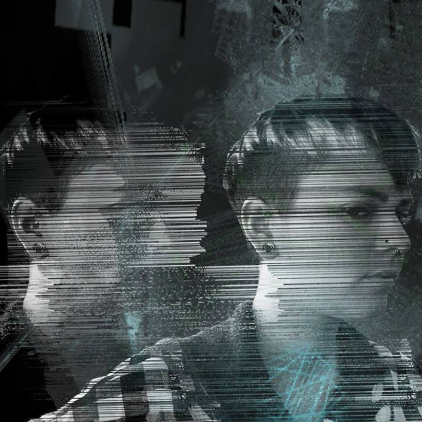

# 2015 Winter Immersive Class:
 
=======
## Teachers
> 
###[Neal Riley](http://www.nealmakesnoise.com) is an instructor with Gray Area for 5 years, in topics ranging from Music Technology to Web Development.  He has had many positions, including Software Developer at Apple, Apprenctice to Roger Linn, and a dishwasher and a small Taiwanese Restaurant.
=======
## Students

> 
###[Jeffrey Yoon](https://www.flickr.com/photos/7258294@N06/)
A DESIGNER.

> 
###[Dan Sullivan](https://github.com/dullivan)
I'm a professional artist in so far as one time someone bought my drawing from a gallery. It was "$2.29 Out the Door" for a drawing of a tall can, and the gallery was a shipping container filled with trash. I also make apps for librarians all day.

> 
###[Vivien Park](http://gravitymax.wordpress.com)
I learn everything from Youtube. I also love cats.

> 
###[Tonia](http://konversation.us)
design & develop art & tech. social internet baby genie, part time pixel princess.

> 
###[Vanessa Li](https://github.com/devanessa) 
A backend software engineer at Rdio with a background in classical piano, music technology and architectural acoustics. Previously, she was at Avid Technology working on the audio engine for ProTools.

> 
###[Zoey Vero] (www.zoeyvero.com) is a Visual and Installation Artist
 
