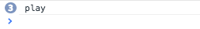

# Rock Paper Scissors

We are going to make a rock paper scissors game where the user plays again the computer. We will learn to use a text input, a button, and adding text to the screen.

Complete code for this example can be found in the `code` folder of this week's class materials.

First, make a basic HTML page called index.html, and remember the `<script>` tag to include our JavaScript file called index.js:

<pre><code>
&lt;html&gt;
    &lt;head&gt;
        &lt;script type="text/javascript" src="index.js"&gt;&lt;/script&gt;
    &lt;/head&gt;
    &lt;body&gt;
    &lt;/body&gt;
&lt;/html&gt;
</code></pre>

Add a title and some description of the game. Consider using `<title>`, `<h1>`, and `
` HTML elements, or whatever else you think will look cool.

### Text Input

Now we need a way for the user to tell the computer their move. For this we will use a text input:

<pre><code>
&lt;input id="user-input"&gt;
</code></pre>

Add this to your HTML, refresh the page, and go to the developer console so we can play around with the `<input>` element. (You can get to the developer console in Chrome by right click -> inspect element, then in the sub-window that appears click on the Console tab).

Try typing this in the console:

<pre><code>
var user_input = document.getElementById("user-input");
user_input.value
</code></pre>

Enter something in the input box and do `user_input.value` again in the console. Notice that `user_input.value` is the string of whatever is in the input box.

OK, we'll come back using that bit of JavaScript in a bit. Next we need a button for the user to submit their move:

### Button

Add the HTML for a button to our page:

<pre><code>
&lt;button&gt;Play&lt;/button&gt;
</code></pre>

So, the user will enter their move in the input box and then click the Play button. When they click the Play button, we want to run some JavaScript code to determine whether the user wins or the computer wins.

In order to run code <i>when</i> the user clicks the button, we will add an `onclick` attribute to the button like so:

<pre><code>
&lt;button onclick="play();"&gt;Play&lt;/button&gt;
</code></pre>

The JavaScript code `play();` will run <i>when the button is clicked</i>. This code calls a function, so we'd better write that function in our JavaScript file:

<pre><code>
function play() {
	console.log("play");
}
</code></pre>

Try this out and look at the developer console to see what happens when you click the button. Note that multiple `console.log` statements will sometimes appear on the same line in the developer console, but with a little counter on the left like so:

</img>

<h3> If Statements </h3>

OK, so when the user enters their move and clicks Play, we need to see what move they have chosen, compare that to the computer's move to decide the winner, and display that to the screen.

Change the `play` function so it logs the user's move to the console, and save the user's move to a variable `user_move`. This is purposefully not shown in a little code box for you; I think you can figure it out based on what we've already done :)

Next, to keep things simple at first, let's just say the computer always chooses "rock." Maybe the user won't notice! OK, well, they probably will, but we'll fix this later.

So, how can we determine who wins? Well, if the user chooses rock, it's a draw (no one wins). If the user chooses paper, the user wins. If the user chooses scissors, the computer wins. This kind of logic, where we break it down into cases like "if this happens... then do this..." is what we use an `if` statement for in code:

<pre><code>
var outcome;
// NOTE this is if the computer always chooses "rock"
if (user_move === "rock") {
	outcome = "draw";
} else if (user_move === "paper") {
	outcome = "The user wins!";
} else if (user_move === "scissors") {
	outcome = "The computer wins!";
} else {
	outcome = "unknown";
}
console.log('The outcome of the game is:', outcome);
</code></pre>

`user_move === "rock"` is a conditional statement. What we care about with conditional statements is whether they are true or false. To get the gist of what this statement means, you can read it aloud to yourself like, "user\_move _is equal to_ 'rock'". We are <i>not</i> changing the value of user\_move. We are <i>not</i> assigning "rock" to be the value of user\_move. We are checking to see if the current value of user\_move already is "rock". Sometimes that statement is true, and sometimes that statement is false. When the statement is true, we say that the conditional evaluates to true, and when the statement is false, we say that the conditional evaluates to false.

The way an if statement works is that the computer checks whatever condition is inside the parentheses `( ... )`. If the condition evaluates to `true`, it runs the code inside the curly braces `{ ... }` for that if statement and then moves on to the code after the last curly brace of the if/else statements. If the condition evaluates to `false`, then it does not run the code inside the first curly braces, and moves on to the `else` part. For what we've written, the `else` part contains another `if` statement, which behaves the same way.

So for example, if user\_move is "rock", then the first condition `user_move === "rock"` evalues to true, so outcome gets assigned the value "draw" and then the computer skips to the `console.log(...)` at the end.

If user\_move is "paper", then the first condition evaluates to false, so the computer moves on the else part. The else part has another if statement, so the computer checks the next condition `user_move === "paper"`, which evaluates to true, so then outcome gets assigned the value "The user wins!" and the computer skips to the `console.log(...)` at the end.

What if user\_move is something totally weird, that's not "rock", "paper", or "scissors"? Then the code gets all the way to the final else, and outcome gets assigned the string value "unknown".

Try playing around in the developer console with conditional statements to get a feel for them. As another example, try this:

<pre><code>
var x = 2;
</code></pre>

What does `x === 2` evaluate to when you enter it in the console? What about `x === 3`? What about `x !== 3`?

We can think of `===` as saying <i>is equal to</i>. The opposite is `!==` which is like saying <i>is not equal to</i>. So, in the above example `x !== 3` evaluates to `true` because x is 2 and 2 is not equal to 3.

Note: You might see other people using `==` and `!=` in JavaScript. <strong>NEVER USE `==` or `!=`</strong>. Just don't. The way it works is really weird and counterintuitive; weird things end up being considered equal.

### Displaying the result

OK, so now that we have figured out who won, we should display it on the screen so the user can see! Let's add this to our HTML:

<pre><code>
&lt;div id="outcome"&gt;&lt;/div&gt;
</code></pre>

Then we can put the game outcome there using this JavaScript:

<pre><code>
var outcome_div = document.getElementById("outcome");
outcome_div.innerHTML = outcome;
</code></pre>

### Random choice

So our game is kind of working right now! But I think people are going to notice that you always win by choosing "paper"... we should make the computer choose its move at random from the possible options "rock", "paper", and "scissors".

It's a little bit roundabout, but we can do this by making an array of the possible choices:

<pre><code>
var possible_moves = ["rock", "paper", "scissors"];
</code></pre>

Then we know that `possible_moves[0]` is "rock", `possible_moves[1]` is "paper", and `possible_moves[2]` is "scissors". So, if we can randomly choose a number 0, 1, or 2, then we can use that to randomly choose one of "rock", "paper", or "scissors".

Here is a bit of math about how to get a random number 0, 1, or 2. If you like math you might like this part. If not it's not a big deal and feel free to skip to what we get at the end of this paragraph: `Math.random()` is a function that returns a random number between 0 and 1. The random number returned can be equal to 0, but it is always less than 1. So `Math.random()*3` is a random number between 0 and 3, where it can be equal to 0 but is always less than 3. But this is a decimal number (like it could be something like 1.5) and `possible_moves[1.5]` doesn't make sense. So, we will take this decimal number and _round down_ to the nearest integer using `Math.floor()`. So what we get is

`Math.floor(Math.random()*3)`

which randomly gives 0, 1, or 2.

So, the computer's random choice of a possible move can be done using this code:

<pre><code>
var i = Math.floor(Math.random()*3);
var compuer_move = possible_moves[i];
</code></pre>

### Game logic

Now that you have the user choosing a move, and the computer choosing a move, how would you change the code to figure out who really wins?

### Bonus

Just some suggestions for what to do next to make this game cooler...

- CSS to make it look better
- Adding images with `` to go with rock, paper, scissors

